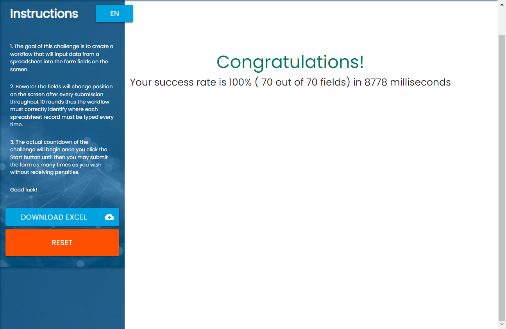

# RPA Challenge by Robot Framework + Selenium

ในโปรเจคนี้เป็นการใช้งาน Robot Framework ร่วมกับ Selenium เพื่อทำการส่งข้อมูลให้กับ RPA Challenge โดยอาศัยความรู้พื้นฐานดังนี้
* Robot Framework
* Selenium
* XPath
* Data-Driven

ความสนุกอยู่ที่ทำอย่างไรที่เราจะทำการอ่านข้อมูลจาก challenge.xlsx เพื่อกรอกลงในฟอร์มของ RPA Challenge ได้ไวที่สุด แต่ทั้งนี้ทั้งนั้นก็จะมีปัจจัยที่ควบคุมไม่ได้ เช่น ระหว่างที่ Client ส่งข้อมูลให้กับ Server ก็จะขึ้นอยู่กับ Internet ในช่วงเวลานั้นๆ หรือการประมวลผลของ Server ในช่วงเวลาดังกล่าว เป็นกำลังใจให้ทุกท่านนะครับ อย่าลืมเอาผลคะแนนมาโชว์กันบ้างนะครับ !!!



## How to run
* Clone git by this command
```
git clone https://github.com/ppraserts/rpachallenge-robotframework.git
```
* Restore package
```
pip install -r requirements.txt
```
* Run Robot Framework
```
robot test_rpachallenge.robot  
```